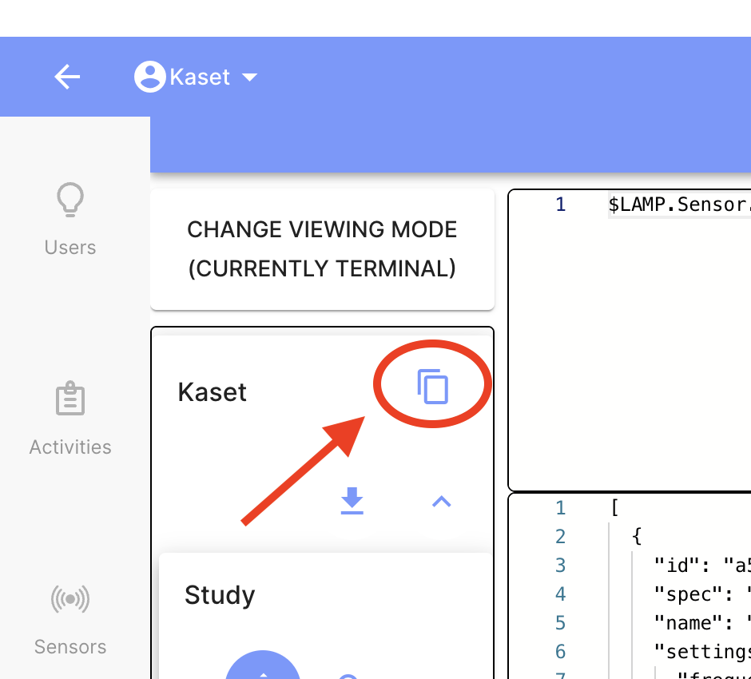

## Crédits / Auteurs
This project is based on an initial version developed by Mr. Punn Chunwimaleung (2024).  
The codebase and this README were later adapted and improved by Procom Santé Connectée (**updated: 2025/2026**).

## Introduction
This project was developed as part of the **Procom - Santé Connectée** study, which focuses on connected follow-up after stroke, particularly in the context of monitoring and secondary prevention to help reduce recurrence risk.  
The **mindLAMP** platform is used to collect and centralize participant data through digital tools such as smartphones and connected devices including smartwatches.  
In this context, the repository provides Python scripts to export **activity** and **sensor** data into CSV files for subsequent processing and analysis.


## Project Structure
```text  
    PROCOM_CODE/
    ├── export_data_activity.py
    ├── export_data_sensor_csv.py
    ├── export_both.py
    ├── utility.py
    ├── requirements.txt
    ├── sample.env
    ├── README.md
    ├── logs/
    └── output/
        ├── activity/
        └── sensor/
            └── general/

```

## Main scripts

This project contains three main scripts:

- `export_data_sensor_csv.py`: exports sensor events from the **Procom** study on the LAMP platform. It retrieves participants, collects sensor events, filters sensors starting with `lamp.*`, and generates CSV files. A general export is created, along with one CSV file per sensor type, with the `data` field expanded into columns.

- `export_data_activity.py`: exports questionnaire / activity data from the same study and saves the results in CSV format for further analysis.

- `export_both.py`: runs both export scripts sequentially, allowing sensor data and activity data to be exported in a single execution.

## Notes
The sensor export script is based on a previous version and was adapted to improve both automation and output organization.  
In the previous version, the export workflow required more manual interaction through terminal inputs.  
The current version simplifies execution by automatically processing all participants in the selected study, storing the generated files in a more structured directory layout, and ensuring that parent folders are created automatically before writing the CSV files.

## Main modifications (v2)

Compared with the initial version, this version introduces the following improvements:

- clearer project organization
- addition of a combined script to run both exports at once
- improved sensor export output structure
- automatic creation of output directories when needed

## Output

The generated CSV files are stored in the `output/` directory.

- Activity export:
  - one CSV file containing all exported activity data
- Sensor export:
  - one general CSV file containing all filtered sensor events
  - one CSV file per sensor type


## Prerequisites

- Python 3.7 or higher
- `pip` package manager

## Setup Instructions

### 1. Create a Virtual Environment (Optional but Recommended)

Creating a virtual environment helps to manage dependencies and avoid conflicts with other projects.

`python -m venv lamp_env`

and activate it:

On Mac and Linux use `source lamp_env/bin/activate` <br>
On Windows use `lamp_env\bin\activate`


### 2. Install Required Packages
Make sure you have pip installed. Then, install the necessary packages:

`pip install -r requirements.txt`

### 3. Create a `.env` File

Create a `.env` file in the root directory of the project and add the following variables (see example `sample.env`):

```
URL=<your_lamp_server_url>
EMAIL=<your_lamp_email>
PASSWORD=<your_lamp_password>
RESEARCHER=<your_researcher_id>
```

To get the `RESEARCHER` ID:
1. Log in to the mindLAMP platform.
2. Click on the `Data Portal` tab.
3. Copy the Researcher ID:


### 4. Run the Script

Run the script with the following command:

for exporting activity data:
`python export_data_activity.py`

or

for exporting sensor data:
`python export_sensor_data_sensor_csv.py`

or

for both export process
`python export_both.py`


